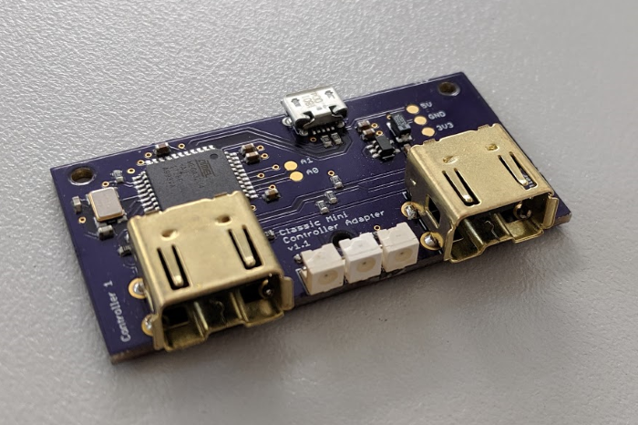
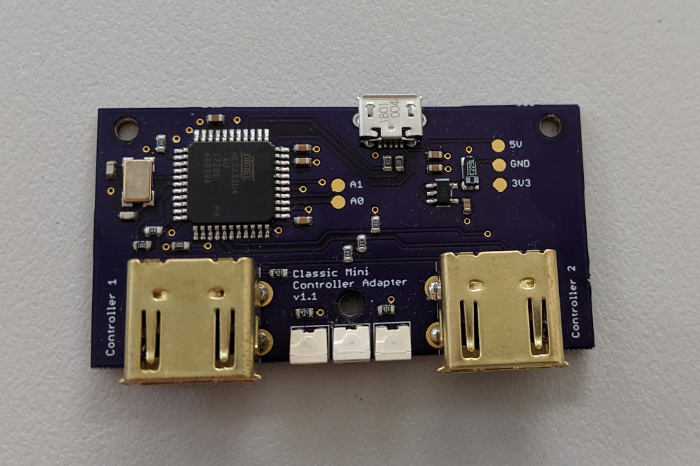
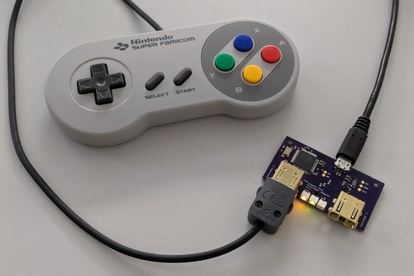
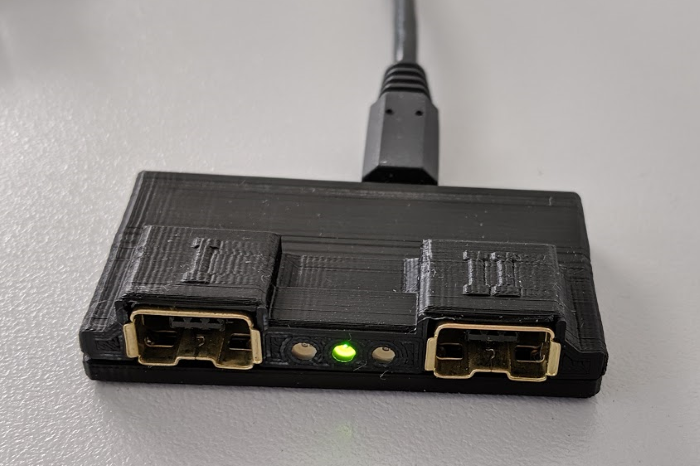

# Nintendo Classic Mini Controller USB Adapter #

This is an adapter for connecting one or two Nintendo Classic Mini controllers via USB to a computer.
It works with the controllers of a Nintendo NES and SNES Classic Mini.

## Motivation ##

I like playing old retro games on a Raspberry Pi running RetroPie on my TV screen. I also have a Nintendo SNES Classic Mini and like the quality and feel of its controllers. So why not connect the controllers to the Raspberry Pi? Well, Nintendo uses their own connectors and protocol which are incompatible with a PC/laptop/Raspberry Pi. But the connectors are available to buy on the Internet and the protocol specification can be found as well. So I created a small piece of hardware around an ATmega32U4 microcontroller to translate the controller's signals to USB.

## Hardware ##

This is basically an Arduino like the Leonardo or [SparkFun Pro Micro](https://www.sparkfun.com/products/12587), running two software I2C buses. It runs at 3.3 Volts and 8 MHz.

### LEDs ###

There are three LEDs on the board. The outer yellow LEDs indicate if a controller on the corresponding port was detected. The ports are hot-pluggable. The green LED in the center indicates that the device has booted and is operational.

### PCB ###

The PCB layout and part list can be found in [schematic](schematic).

You can order the unpopulated board directly from [OSH Park](https://oshpark.com/shared_projects/MKpWshOk).

Most parts can be bought from the usual distributors such as Farnell, DigiKey, Mouser etc. The connectors are a little bit harder to get. You can find them on eBay or AliExpress if you search for **Wiimote connector**. The components cost me about $11.

## Software ##

### Bootloader ###

I recommend flashing the SparkFun Pro Micro 3.3 V/8 MHz bootloader. Add the [SparkFun board definitions](https://github.com/sparkfun/Arduino_Boards) to your Arduino IDE. You will find the instructions on their GitHub page. Use the Arduino IDE together with an AVR programmer and the backside ICSP header of the board to burn the bootloader for the 3.3 V/8 MHz variant. If you don't have an AVR programmer, you can use an Arduino with the **ArduinoISP** sketch as a programmer.

Please note that the board operates at 3.3 V. Your programmer or Arduino must work with 3.3 V logic levels. Don't use 5 V levels! If your programmer supports 5 V and 3.3 V to power the board, set it to 3.3 V. I am using the [Diamex USB ISP programmer](https://www.diamex.de/dxshop/DIAMEX-USB-ISP-Programmer-Stick-fuer-AVR) which is inexpensive and works great.

### Firmware ###

The firmware (Arduino sketch) uses the awesome [joystick library](https://github.com/MHeironimus/ArduinoJoystickLibrary) written by Matthew Heironimus. You will need to download and add it to your Arduino libraries before you can compile the firmware.

After burning the bootloader, the device should appear as a SparkFun Pro Micro when connected via USB to your computer. You can then compile and download the sketch with the Arduino IDE. Select the SparkFun Pro Micro 3.3 V/8 MHz device in the Arduino IDE.

### Windows ###

Windows will detect the board as two gamepads, no further drivers needed. Any modern game should be able to use the gamepads.

### Linux ###

Linux systems will detect only one controller by default. To make Linux detect both controllers, edit the file **/boot/cmdline.txt** and add

`usbhid.quirks=0x1b4f:0x9204:0x040`

## Case ##

I have created a case to protect the PCB. The case can be printed on a 3D printer. For the top part I recommend to print it with the front down to get the LED openings right. The top and bottom parts are held together be three M2 screws.

## License ##

The schematic, software and case are released under the Creative Commons BY-NC-SA 4.0 license. Check out [LICENSE.txt](LICENSE.txt) and the image link below for what you may and may not do with the files.

